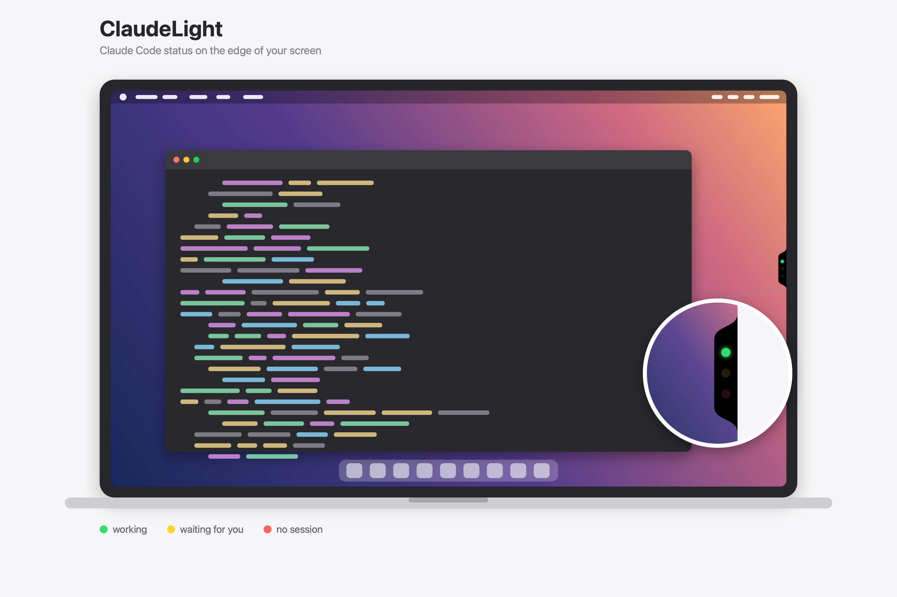

# ClaudeLight

A tiny traffic light that sits on the edge of your Mac screen and shows what [Claude Code](https://claude.com/claude-code) is doing, so you can work on something else and glance instead of switching windows.



- **Green** – at least one Claude session is working
- **Yellow** – at least one session is waiting for you (finished answering, asking permission, or asking a question)
- **Red** – no Claude session is open

With several sessions open, green and yellow can be lit at the same time. Red only lights when nothing is running. Works for the Claude desktop app and for `claude` in any terminal (Terminal, iTerm, VS Code, …).

**Also works with OpenAI's Codex CLI.** Yes, it's still called ClaudeLight 😄. The traffic light doesn't care who's driving: Codex sessions light the same dots, and the installer registers the hooks automatically when it finds Codex on your machine.

## Install

Requires macOS 13+, Xcode Command Line Tools (`xcode-select --install`) and `jq` (`brew install jq`). If you received a zip that already contains `ClaudeLight.app`, the Command Line Tools are optional; the installer uses the prebuilt app when `swiftc` is missing.

```bash
git clone https://github.com/hhlorsdemir/ClaudeLight.git
cd ClaudeLight
./install.sh
```

This builds the app, copies it to `~/Applications`, installs a small hook script, registers the hooks in `~/.claude/settings.json` (a backup is kept next to it), adds ClaudeLight as a login item and launches it. If Codex CLI is installed, the same hooks are registered in `~/.codex/hooks.json`. Use `./install.sh --no-login` to skip the login item.

Sessions opened before installing are not tracked; new ones are picked up automatically.

## Use

- **Left click** – bring the Claude desktop app to the front (launches it if closed)
- **Drag** – move the light up or down; it stays glued to the edge
- **Right click** – snap to the left or right edge, switch to compact single-light mode, quit

Compact mode shows one dot with priority green → yellow → red. All choices are remembered.
The light is hidden from the Dock, shows on every Space and stays above full-screen apps.

## How it works

Claude Code [hooks](https://docs.claude.com/en/docs/claude-code/hooks) (and Codex CLI hooks, which use the same format) call `~/.claude/hooks/claude-light.sh` on each event. The script writes one small file per session under `~/.claude/claude-light/state/` containing `working` or `waiting`, and deletes it on `SessionEnd`. The app polls that folder and lights the dots.

| Event | State |
|---|---|
| `UserPromptSubmit`, `PreToolUse`, `PostToolUse` | working |
| `SessionStart`, `Stop`, `Notification`, `PermissionRequest` | waiting |
| `SessionEnd` | file removed |

Files older than 12 hours are ignored, so a session that was killed without a clean exit does not keep a light on forever.

## Customize

Sizes and colours are constants at the top of `main.swift` (`normalSize`, `compactSize`, dot size `d`, spacing `gap`, edge curve `flare`). After editing:

```bash
./install.sh
```

## Uninstall

```bash
./uninstall.sh
```

Removes the app, the hook script, the hook entries from `settings.json` (other hooks are left untouched), the login item and the state files.

## License

MIT
